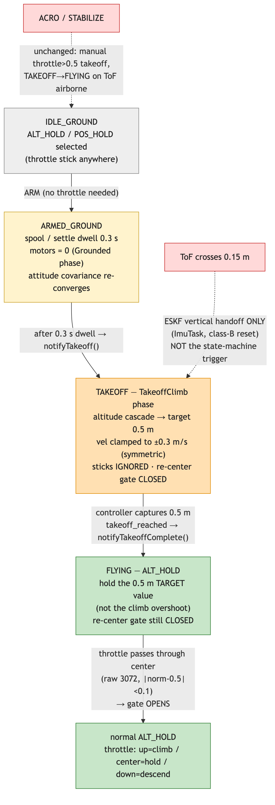
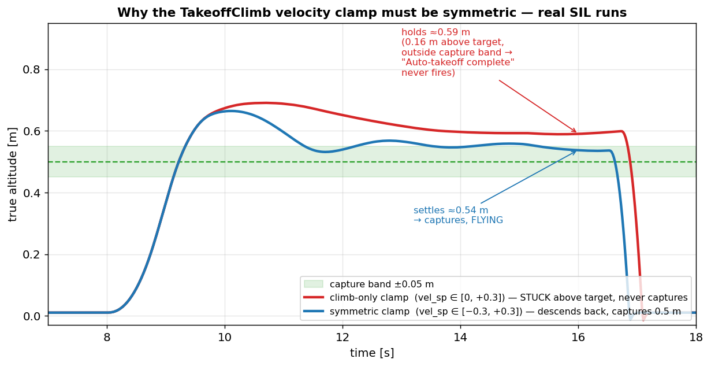

# ALT_HOLD/POS_HOLD 自動離陸 — シーケンスと 2 つの落とし穴

> **Note:** [English version follows after the Japanese section.](#english) / 日本語の後に英語版があります。

## 1. 概要

### このドキュメントについて

2026-06-14 の ALT_HOLD/POS_HOLD 離陸シーケンス再設計（ARM 起動離陸・目標 0.5m 捕捉・スロットル再センターゲート）の実装中に表面化した、**2 つの落とし穴**を実測データの図とともに解説する。どちらも「制御則そのものは正しく、前提（テスト用の数値・クランプの向き）が誤っていた」もので、SIL（ソフトウェア・イン・ザ・ループ＝実ファームをホストで走らせ MuJoCo で物理を閉じる試験環境）が炙り出した。

図はすべて **実際の SIL トラジェクトリ**（`trajectory.csv`）から matplotlib で描いた実測グラフ、または mermaid で描いた状態遷移図である。

### 対象読者

vehicle の制御・状態機械を読む人、および同種のドローン離陸ロジックを設計する人。

### 全体シーケンス

ALT_HOLD/POS_HOLD の離陸は **ARM 自体がトリガ**になる（スロットル操作不要）。短いスプール整定の後、制御器が高度カスケードで目標 0.5m まで上昇して**目標値を捕捉**し、状態機械へ完了を通知して FLYING へ移る。ToF の 0.15m 空中検知は ESKF 鉛直ハンドオフ専用で、状態遷移のトリガには使わない。



## 2. 離陸シーケンスと時系列（実測）

下図は実 SIL ラン（`alt_auto_takeoff` シナリオ、ノイズ off、決定論的）の高度時系列である。真値（青）と ESKF 推定（赤破線）、フェーズ帯（ARMED_GROUND／TAKEOFF／FLYING）、地上ブラインド窓、ToF ハンドオフ、行き過ぎピーク、目標捕捉を重ねた。


各イベントの時刻・高度・モードを表にまとめる（上図と対応）：

| フェーズ／イベント | 時刻 | 高度（真値） | 状態・モード | 動作 |
|------|------|------|------|------|
| ARM 受理 | 7.50 s | 0 m | IDLE_GROUND → ARMED_GROUND | プロペラ 0（Grounded フェーズ）、スプール整定 0.3 s 開始 |
| スプール完了 → 離陸 | 7.84 s | 0 m | ARMED_GROUND → TAKEOFF | `notifyTakeoff()`、props on・上昇開始（TakeoffClimb フェーズ） |
| ToF ハンドオフ | 8.64 s | 0.15 m | TAKEOFF | ESKF 鉛直リセット（クラスB, ImuTask）。推定が真値の追従を開始 |
| 行き過ぎピーク | 10.1 s | **0.66 m** | TAKEOFF（TakeoffClimb） | 地上ブラインド窓由来の運動量で目標 0.5m を超過 |
| 目標捕捉 → FLYING | 11.5 s | **0.5 m**（→ ~0.54 m 整定） | TAKEOFF → FLYING | 制御器が目標を捕捉し `takeoff_reached` 通知 → ALT_HOLD 係合 |

ポイントは、**最終的な保持高度が「行き過ぎたピーク 0.66m」ではなく「目標値 0.5m（実測 ~0.54m）」になる**こと。旧仕様は ToF 0.15m で運動量任せに高度を捕捉していたが、新仕様は目標値で捕捉するため決定論的に 0.5m へ収束する。

## 3. 落とし穴 1 — スロットルの「中央」は raw 2048（バネ静止）。実は規約自体がバグだった

この落とし穴は **2 層構造**だった。表面のテストミスを直したら「通った」が、その下に**実機で操縦不能になる規約バグ**が隠れていた。

### 第1層（表面）— テストの中央取り違え

実装当初のファームは ALT_HOLD のスロットル→上昇率を `climb = (norm − 0.5)·2·max_climb`（norm は STABILIZE 用の `[0,1]`）で計算しており、**ホールド（climb=0）は norm 0.5 = raw 3072** だった。SIL シナリオで「中央へ戻す」を raw 2048 と書いたら、2048 は norm 0.0 ゆえ `|0.0 − 0.5| = 0.5 > deadzone` で**再センターゲートが一度も開かず**テストが空振りした。シナリオを 3072 に直したら通った——が、これは**バグに合わせてテストを歪めた**だけだった。

### 第2層（本当のバグ）— 規約がハードウェアと真逆

コントローラのスロットルは**バネ復帰式で raw 2048 が静止位置**（`protocol/spec/messages.yaml`・コントローラのキャリブが中央2048基準）。ところが当時のファームは静止 2048 を「全力降下 −0.5 m/s」と解釈していた：

| 生 ADC | 当時のファーム（バグ）| 飛行実績の旧 vehicle |
|------|------|------|
| **2048（離した静止）** | **−0.5 m/s 降下** | **ホールド** |
| 3072 | ホールド | 上昇 |
| 4095（全上げ）| +0.5 m/s | 最大上昇 |

旧 vehicle `altitude_controller.hpp` は明示的に「**Stick center (2048) = hold altitude**」「バネ復帰式なら離すだけでロック解除」と書いており、`(raw−2048)/2048 ∈ [-1,+1]`（中央2048=hold）を使う。当時の vehicle は STABILIZE 用 `[0,1]` を `(throttle−0.5)` で流用したため中立が raw 3072 にズレ、**スロットルを離す（バネで2048に戻る）と降下＝離せばホバーできない**。SIL が通ったのは「ファーム自身の（誤った）規約」をテストに注入したからで、バネ物理を模擬しないため見抜けなかった（ALT_HOLD 実機未検証ゆえ未発覚）。

### 是正 — 対称方式（中央2048=ホールド・上=上昇・下=降下）

ユーザー確定で、ALT_HOLD/POS_HOLD を旧 vehicle と同型の**対称スロットル**に直した（`CommandSetpoint.throttle_axis = (raw−2048)/2048 ∈ [-1,+1]`）。**中央 2048 = 0 = ホールド**、上=上昇（`altitude.climb_rate`）、下=降下（`altitude.descent_rate`、上昇/降下は別パラメータ）。STABILIZE/ACRO は従来どおり `throttle [0,1]`（中央=推力0）。下図に両解釈を示す。


| 生 ADC | STABILIZE 推力 [0,1] | ALT_HOLD 指令（対称）|
|------|------|------|
| 1024 | 0（クリップ）| **−降下** |
| **2048（バネ静止）** | **0 = OFF** | **0 = ホールド** |
| 4095（全上げ）| 1 = 最大推力 | **+上昇** |

### ゲートの実動作（是正後）

下図は実 SIL ラン（`alt_recenter_gate`）。左軸=高度、右軸=throttle_axis。ゲート閉中はスロットルを上げたまま保持しても 0.5m に留まり（上げ無視）、**中央(2048)に戻すとゲート開**→上げで上昇→**下げで降下**（対称の新機能）→中央で保持、と一連で動く。再センターゲートは「バネを離せば中央に戻って解除」＝旧 vehicle stick-lock と同型。


## 4. 落とし穴 2 — TakeoffClimb の速度クランプは対称でなければならない

### カスケード構造

TakeoffClimb は通常の ALT_HOLD と同じ 2 段カスケードを、目標 0.5m に向けて回す：

```
外側(位置)ループ:  vel_sp = alt_pos.compute(目標 0.5m, 高度推定)
                  （vel_sp を ±takeoff_climb_rate = ±0.3 m/s にクランプ）
内側(速度)ループ:  thrust_corr = alt_vel.compute(vel_sp, 鉛直速度推定)
```

目標近傍で外側ループの誤差が小さくなり vel_sp が 0 へ落ちる → 減速して**目標を捕捉**、という算段。

### 地上ブラインド窓（観測不能性）

ESKF は離陸前、鉛直の位置・速度を **0 に固定（hold）**している。鉛直を見られる唯一のセンサ ToF が **約 0.15m 以上**でしか安定ロックしないためで、0.15m を超えた瞬間にハンドオフして実値へ切り替える。

問題は、**離陸の最初の 0.15m（約 0.25 秒）の間、機体は物理的に加速して上がっているのに鉛直速度推定は 0 に凍っている**こと。内側ループは「指令 +0.3 m/s、推定速度 0」の誤差を出しっぱなしにして推力補正を上限まで張り付かせ、その間に機体は **~0.6 m/s** まで加速する。ハンドオフ後に推定速度が実値へ飛ぶと、運動量で目標 0.5m を **~0.66m まで超過**する（これは ESKF 設計に内在する過渡で、バグではない）。

### climb-only クランプが捕捉に失敗する理由

最初の版は「離陸＝上昇」という思い込みで片側クランプ（`vel_sp < 0 → 0`、降下指令を 0 で潰す）にしていた。すると 0.66m に行き過ぎた後、外側ループが「降りて戻れ」という負の vel_sp を出しても 0 に潰され、**機体は 0.66m に居座ったまま降りてこられない**。捕捉判定 `|0.5 − 高度| < 0.05m` に永久に入らず、`Auto-takeoff complete` が出ず、TAKEOFF→FLYING が発火しない。

下図が両クランプの実 SIL ラン比較。**climb-only（赤）は ≈0.59m で居座り捕捉に失敗**、**対称クランプ（青）は行き過ぎ後に緩降下して 0.5m を捕捉**する。



### 修正

```
if (vel_sp >  takeoff_climb_rate) vel_sp =  takeoff_climb_rate;
if (vel_sp < -takeoff_climb_rate) vel_sp = -takeoff_climb_rate;   // ← 緩降下も許す
```

要は「**離陸＝目標へ整定する閉ループ**であって片道の上昇ではない」ので、行き過ぎを下方修正できる両方向の自由度が必須。これで peak 0.66m → 目標 0.5m へ減速 → ~0.54m で安定保持（alt_rmse 1.5cm）。残る ~0.16m の overshoot 自体はブラインド窓由来の過渡で、実機で大きければソフトスタートで抑えられる（実機チューニング項目）。

## 5. まとめ・教訓

| # | 落とし穴 | 真因 | 教訓 |
|---|---------|------|------|
| 1 | ゲートが開かない→**実は規約バグ** | ①テストの中央取り違え（バグに合わせて歪めた）→ ②規約自体が誤り（中立 raw 3072 がバネ静止 2048 と真逆＝離せば降下） | **SIL が通っても規約が正しいとは限らない**。ハードの物理（バネ静止2048）と飛行実績（旧 vehicle=中央2048ホールド）に照合する。対称 throttle_axis へ是正 |
| 2 | 目標を捕捉できない | 速度クランプを片側（上昇のみ）にした | 捕捉は片道でなく**双方向の整定問題**。観測不能窓の行き過ぎを下げて戻す自由度が要る |

落とし穴2は制御則自体は正しく前提ミスを SIL が炙り出した例。落とし穴1は逆に、**SIL の偽合格が規約バグを覆い隠していた**例で、実機ハードの物理と飛行実績コードへの照合が決め手になった。いずれも「数値で裏付けてから実装・コミット」（CLAUDE.md 規約）に加え、**模擬が物理を写しているか**を問う重要性を示す。

---

<a id="english"></a>

## 1. Overview

### About This Document

During the 2026-06-14 redesign of the ALT_HOLD/POS_HOLD takeoff sequence (ARM-triggered takeoff, 0.5 m target capture, throttle re-center gate), **two pitfalls** surfaced. This document explains them with figures plotted from real SIL data. In both, the control law itself was correct — the wrong assumption was in the test constant or the clamp direction — and SIL surfaced them.

All figures are real measurements: matplotlib plots of actual SIL `trajectory.csv`, or a mermaid state diagram.

### Overall Sequence

In ALT_HOLD/POS_HOLD, **ARM itself triggers the takeoff** (no throttle input). After a short spool dwell, the controller climbs the altitude cascade to the 0.5 m target, **captures the target value**, notifies the state machine, and moves to FLYING. The ToF 0.15 m airborne detection is for the ESKF vertical handoff only, not the state-transition trigger.


## 2. Takeoff Sequence and Timeline (measured)

The figure below is a real SIL run (`alt_auto_takeoff`, noise off, deterministic): true altitude (blue) and ESKF estimate (red dashed), with phase bands, the ground blind window, the ToF handoff, the overshoot peak, and the target capture.


| Phase / event | Time | Altitude (true) | State / mode | Action |
|------|------|------|------|------|
| ARM accepted | 7.50 s | 0 m | IDLE_GROUND → ARMED_GROUND | props 0 (Grounded phase), 0.3 s spool dwell starts |
| spool done → takeoff | 7.84 s | 0 m | ARMED_GROUND → TAKEOFF | `notifyTakeoff()`, props on, climb starts |
| ToF handoff | 8.64 s | 0.15 m | TAKEOFF | ESKF vertical reset (class-B, ImuTask); estimate tracks truth |
| overshoot peak | 10.1 s | **0.66 m** | TAKEOFF (TakeoffClimb) | blind-window momentum overshoots the 0.5 m target |
| target captured → FLYING | 11.5 s | **0.5 m** (settles ~0.54 m) | TAKEOFF → FLYING | controller captures target, `takeoff_reached` → ALT_HOLD |

The key point: the final hold altitude is the **0.5 m target value (≈0.54 m measured), not the 0.66 m overshoot peak**. The old spec captured whatever altitude momentum carried it to at ToF 0.15 m; the new spec captures the target value deterministically.

## 3. Pitfall 1 — Throttle "center" is raw 2048 (spring rest); the convention itself was a bug

This was a **two-layer** pitfall. Fixing the surface-level test mistake made it "pass", but underneath was a **convention bug that would make ALT_HOLD unflyable on real hardware**.

### Layer 1 (surface) — wrong center in the test

The initial firmware computed ALT_HOLD climb as `climb = (norm − 0.5)·2·max_climb` (norm is the STABILIZE `[0,1]`), so **hold (climb=0) was at norm 0.5 = raw 3072**. The SIL scenario used raw 2048 for "center"; since 2048 is norm 0.0, `|0.0 − 0.5| = 0.5 > deadzone` and the re-center gate never opened. Changing the scenario to 3072 made it pass — but that just **bent the test to match the bug**.

### Layer 2 (the real bug) — the convention was inverted vs the hardware

The controller's throttle is **spring-centred at raw 2048** (`protocol/spec/messages.yaml`; the controller calibration is centred at 2048). Yet the firmware read the rest position (2048) as a full −0.5 m/s descent:

| raw ADC | firmware then (bug) | flight-proven legacy vehicle |
|------|------|------|
| **2048 (release / rest)** | **−0.5 m/s descend** | **hold** |
| 3072 | hold | climb |
| 4095 (full up) | +0.5 m/s | max climb |

The legacy `altitude_controller.hpp` explicitly says "**Stick center (2048) = hold altitude**" / "release the spring stick to unlock", using `(raw−2048)/2048 ∈ [-1,+1]` (centre 2048 = hold). vehicle reused the STABILIZE `[0,1]` with a `(throttle−0.5)` shift, moving the neutral to 3072 — so **releasing the throttle (spring → 2048) would descend, you could not hover by releasing**. SIL passed because it injected the firmware's *own* (wrong) convention and does not model the spring; ALT_HOLD was never hardware-tested, so it went unnoticed.

### Fix — symmetric scheme (centre 2048 = hold, up = climb, down = descend)

ALT_HOLD/POS_HOLD now use a **symmetric throttle** like the legacy vehicle (`CommandSetpoint.throttle_axis = (raw−2048)/2048 ∈ [-1,+1]`): **centre 2048 = 0 = hold**, up = climb (`altitude.climb_rate`), down = descend (`altitude.descent_rate`, separate params). STABILIZE/ACRO keep `throttle [0,1]` (centre = off).


### Re-center gate in action (corrected)

A real SIL run (`alt_recenter_gate`): with the gate CLOSED, holding the throttle UP still holds 0.5 m; returning to **centre (2048) OPENS the gate**; then up = climb, **down = descend** (the new symmetric capability), centre = hold. The gate = the legacy "release the spring stick to unlock".


## 4. Pitfall 2 — The TakeoffClimb velocity clamp must be symmetric

### Cascade

TakeoffClimb runs the ALT_HOLD cascade toward 0.5 m, with the position-loop velocity clamped to ±takeoff_climb_rate. Near the target the error shrinks, vel_sp falls to 0, and the craft captures the target.

### Ground blind window

The ESKF holds vertical position/velocity at 0 on the ground (ToF only locks above ~0.15 m). For the first ~0.25 s of climb the velocity estimate is frozen at 0 while the craft physically accelerates; the velocity loop saturates the thrust correction and the craft reaches ~0.6 m/s by the handoff, then overshoots to ~0.66 m. This is inherent to the ESKF design, not a bug.

### Why climb-only fails to capture

A one-sided clamp (`vel_sp < 0 → 0`) cannot bring the craft back down after the overshoot — it sits at 0.66 m, never enters the ±0.05 m capture band, so "Auto-takeoff complete" never fires.


### Fix

Clamp symmetrically (±takeoff_climb_rate) so the cascade can gently descend back to the target. Takeoff = a closed-loop settle, not a one-way climb. Result: peak 0.66 m → settles ~0.54 m (alt_rmse 1.5 cm). The ~0.16 m overshoot is a blind-window transient — a hardware tuning item.

## 5. Lessons

| # | Pitfall | Root cause | Lesson |
|---|---------|------------|--------|
| 1 | Gate never opens → **really a convention bug** | (1) wrong center in the test (bent to match the bug); (2) the convention itself was inverted — neutral raw 3072 vs the spring rest 2048 (release → descend) | **A passing SIL run does not prove the convention is right.** Cross-check against the hardware physics (spring rest 2048) and the flight-proven code (legacy = centre 2048 hold). Fixed to a symmetric throttle_axis |
| 2 | Target not captured | velocity clamp was one-sided (climb only) | Capture is a bidirectional settle, not a one-way climb; allow correcting the unobservable-window overshoot back down |

Pitfall 2 is a case where the control law was correct and SIL surfaced a wrong assumption. Pitfall 1 is the opposite — a **false SIL pass masked a convention bug**, and cross-checking against the real hardware physics and the flight-proven code was decisive. Both underscore "back it with simulation before committing" (CLAUDE.md) AND asking **whether the simulation actually mirrors the physics**.
